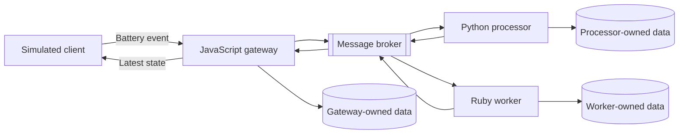

# TLCore

TLCore is a long-lived engineering laboratory for practicing and demonstrating DevOps, platform engineering, site reliability engineering, cloud infrastructure, and security.

The project is built around a small, realistic polyglot distributed application. Its application scope remains intentionally focused so that most engineering effort can go toward deploying, securing, observing, troubleshooting, recovering, and evolving the system.

> **Current status:** Phase 0 — Foundation and engineering governance
> TLCore does not yet contain a runnable application or supported release.

## Project vision

TLCore treats the system itself as the laboratory.

Technologies are introduced only when they solve a demonstrated application, deployment, reliability, security, or operational problem. Each phase must leave behind a working and verifiable capability rather than a disconnected collection of tools.

The permanent environment will remain local and essentially free. Future AWS environments will be temporary, automated, budget-controlled, and destroyed after their intended exercises.

## First application milestone

The first workflow processes a simulated device battery-status event:

1. A client submits a battery event through a JavaScript gateway.
2. The event is processed asynchronously by a Python application.
3. The battery level is classified as `normal`, `low`, or `critical`.
4. A Ruby worker performs a simulated follow-up workflow when attention is required.
5. PostgreSQL stores application-owned processing state.
6. The gateway returns the device’s latest processed state.

The milestone uses simulated data and local services. It does not include real devices, user accounts, cloud deployment, external notifications, or sensitive personal information.

## Initial architecture

The applications may initially share one local PostgreSQL server, but each application owns its schema or assigned tables. Applications exchange cross-boundary information through documented events rather than modifying one another’s data.

See the [full system overview](docs/architecture/SYSTEM_OVERVIEW.md) for responsibilities, trust boundaries, consistency expectations, and deferred decisions.

## Repository strategy

This repository is the canonical entry point for TLCore. It contains:

- Project charter and roadmap
- System-wide architecture
- Architecture Decision Records
- Security and governance policies
- Contribution and development workflow
- Cross-application documentation

Independently deployable applications will receive separate repositories when implementation begins.

Planned repositories include:

| Repository         | Purpose                                        |
| ------------------ | ---------------------------------------------- |
| `tlcore`           | Governance and system documentation            |
| `tlcore-gateway`   | JavaScript gateway and external API            |
| `tlcore-processor` | Python event-processing application            |
| `tlcore-worker`    | Ruby background jobs and integration workflows |
| `tlcore-platform`  | Infrastructure and deployment automation       |

The reasoning and tradeoffs are recorded in [ADR-0001](docs/adr/0001-multi-repository-strategy.md).

## Roadmap

TLCore evolves through capability-based phases:

| Area                      | Phases                                                                                   |
| ------------------------- | ---------------------------------------------------------------------------------------- |
| Foundation                | Phase 0: Governance, architecture, security, and workflow                                |
| Application and packaging | Phases 1–3: Twelve-Factor applications, containers, CI, and supply chain                 |
| Platform and delivery     | Phases 4–6: Kubernetes, infrastructure as code, continuous delivery, and GitOps          |
| Operations and security   | Phases 7–9: Observability, DevSecOps, resilience, performance, and incident response     |
| Cloud and expansion       | Phases 10–12: Ephemeral AWS, personal devices, edge integrations, and platform evolution |

A phase is complete when its operational capability works and has evidence—not when every available tool has been installed.

See the [complete TLCore roadmap](docs/ROADMAP.md).

## Guiding principles

1. **The system is the laboratory.**
2. **Local-first and cloud-compatible.**
3. **Everything reproducible.**
4. **Security from the beginning.**
5. **Observability supports operations.**
6. **Failure is part of the curriculum.**
7. **Complexity must be earned.**
8. **Every phase leaves the system working.**

The [project charter](docs/PROJECT_CHARTER.md) defines the full purpose, goals, non-goals, governance, success criteria, and first application milestone.

## Current Phase 0 progress

Completed foundations include:

- GitHub organization and central repository
- Project charter and bounded first milestone
- Multi-repository strategy
- Initial event-driven architecture
- High-level system diagram
- Architecture Decision Record process
- Initial threat model
- Security-reporting policy
- Cost and credential rules
- Public-repository safety rules
- Contribution and developer workflow
- Branching, review, versioning, and release conventions
- Issue and pull-request templates
- Apache License 2.0

Remaining Phase 0 work includes applying repository protections, completing the public-readiness review, and verifying the contributor experience.

## Documentation

| Document                                                              | Purpose                                                      |
| --------------------------------------------------------------------- | ------------------------------------------------------------ |
| [Project Charter](docs/PROJECT_CHARTER.md)                            | Purpose, audience, goals, non-goals, and initial milestone   |
| [Roadmap](docs/ROADMAP.md)                                            | Long-term capability phases and exit criteria                |
| [System Overview](docs/architecture/SYSTEM_OVERVIEW.md)               | Components, event flow, data ownership, and trust boundaries |
| [Architecture Decisions](docs/adr/README.md)                          | Accepted decisions and the ADR process                       |
| [Repository Governance](docs/governance/REPOSITORY_GOVERNANCE.md)     | Branching, review, merge, versioning, and release rules      |
| [Cost and Credential Policy](docs/governance/COST_AND_CREDENTIALS.md) | Cost controls, credentials, and exposure response            |
| [Threat Model](docs/security/THREAT_MODEL.md)                         | Assets, trust boundaries, priority threats, and mitigations  |
| [Public Repository Safety](docs/security/PUBLIC_REPOSITORY_SAFETY.md) | Publication rules and readiness checklist                    |
| [Contributing](CONTRIBUTING.md)                                       | Contribution and developer workflow                          |
| [Security Policy](SECURITY.md)                                        | Private vulnerability-reporting expectations                 |

## Contributing

TLCore is currently maintained by Trai Lynne Compton.

Contributions should begin by reviewing the project charter, roadmap, architecture decisions, and [contribution guide](CONTRIBUTING.md). Application, infrastructure, and substantial architectural work should begin with a scoped issue.

Security vulnerabilities must not be reported through public issues or pull requests. Follow [SECURITY.md](SECURITY.md).

## License

TLCore is licensed under the [Apache License 2.0](LICENSE).
