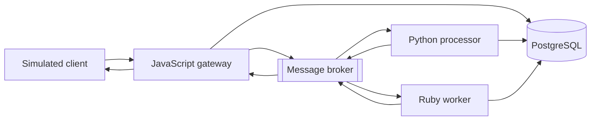

# TLCore

TLCore is a personal engineering laboratory for building practical skills in software engineering, distributed systems, DevOps, platform engineering, site reliability engineering, cloud infrastructure, and security.

The project will grow through a series of working capabilities. Each phase introduces new technical and operational challenges while keeping the application itself intentionally focused. TLCore is a learning platform, not a commercial product.

> **Current phase:** Phase 1 — Build the minimal Twelve-Factor system
>
> Planning is complete. Application implementation is beginning.

## Planned first capability

The first capability will process a simulated device battery-status event:

1. A client submits a battery event through a JavaScript gateway.
2. A Python application processes the event asynchronously.
3. The battery level is classified as `normal`, `low`, or `critical`.
4. A Ruby worker handles every classification, recording `no_action_required`
   for `normal` and performing simulated follow-up for `low` and `critical`.
5. PostgreSQL stores the processing state.
6. The gateway returns the device's latest processed state.

This first capability will run locally with simulated data. It will not use real devices, user accounts, cloud deployment, external notifications, or personal information.

## Planned Phase 1 architecture

The diagram shows the planned direction, not an implemented system. Exact frameworks, libraries, and supporting tools will be chosen as Phase 1 work requires them.

## Planned repositories

TLCore will use separate repositories for independently deployable applications while keeping project-wide direction and documentation here.

| Repository | Purpose |
| --- | --- |
| `tlcore` | Project direction and shared documentation |
| `tlcore-gateway` | JavaScript gateway and external API |
| `tlcore-processor` | Python event-processing application |
| `tlcore-worker` | Ruby background jobs and follow-up workflows |
| `tlcore-platform` | Infrastructure and deployment automation |

Application repositories will be created when their implementation begins, not simply to reserve names.

## Roadmap

TLCore is organized into capability-based phases:

| Area | Phases |
| --- | --- |
| Foundation | Phase 0: project direction, architecture, security, and workflow |
| Application and packaging | Phases 1–3: applications, containers, continuous integration, and software supply chain |
| Platform and delivery | Phases 4–6: Kubernetes, infrastructure as code, delivery, and GitOps |
| Operations and security | Phases 7–9: observability, security, resilience, performance, and incident response |
| Cloud and expansion | Phases 10–12: temporary AWS environments, personal-device integrations, and platform evolution |

See the [full roadmap](docs/ROADMAP.md) for the planned outcomes of each phase.

## Project documentation

- [Roadmap](docs/ROADMAP.md)
- [System overview](docs/architecture/SYSTEM_OVERVIEW.md)
- [Phase 1 service contracts](docs/contracts/README.md)
- [Architecture decisions](docs/adr/README.md)
- [Learning log](docs/LEARNING_LOG.md)
- [Contribution workflow](CONTRIBUTING.md)
- [Security policy](SECURITY.md)

## License

TLCore is licensed under the [Apache License 2.0](LICENSE).
