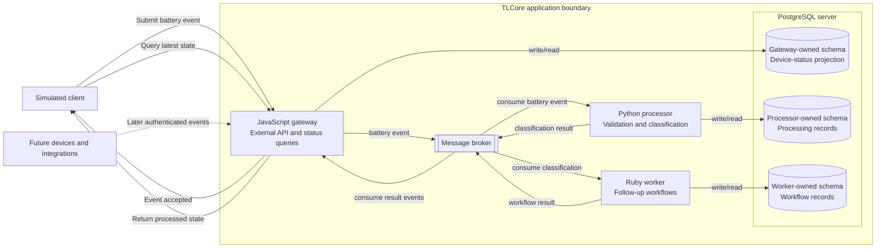

# TLCore System Overview

- **Status:** Initial Phase 0 architecture
- **Last updated:** 2026-08-29
- **Related decision:** [ADR-0002: Begin with an event-driven polyglot architecture](../adr/0002-initial-event-driven-architecture.md)

## Purpose

TLCore begins as a small event-driven platform that receives simulated device signals, processes them asynchronously, stores the resulting state, and exposes that state through an external API.

The first application milestone processes one event type: a simulated device battery-status event.

## High-level architecture

The message names shown in this diagram are conceptual. Exact event names, schemas, and versioning rules will be defined before Phase 1 implementation.

## Component responsibilities

| Component          | Responsibility                                                                                     | Does not own                                  |
| ------------------ | -------------------------------------------------------------------------------------------------- | --------------------------------------------- |
| Simulated client   | Submits demonstration battery events and requests processed state                                  | Business processing or persistence            |
| JavaScript gateway | External HTTP interface, request validation, event publication, and query-facing status projection | Battery classification or follow-up workflows |
| Message broker     | Transfers events between independently operating applications                                      | Business logic or permanent application state |
| Python processor   | Validates domain data and classifies battery levels                                                | Public API or follow-up integration work      |
| Ruby worker        | Creates and completes simulated follow-up jobs                                                     | Public API or battery classification          |
| PostgreSQL         | Provides durable storage through logically separated application-owned schemas                     | Cross-application business coordination       |

## Initial event lifecycle

1. A simulated client submits a battery-status event to the JavaScript gateway.
2. The gateway validates the external request and publishes an accepted event.
3. The Python processor consumes the event and classifies the battery level as `normal`, `low`, or `critical`.
4. The processor records its processing result and publishes a classification event.
5. The Ruby worker consumes the classification and performs any required simulated follow-up work.
6. The worker records the workflow result and publishes a result event.
7. The JavaScript gateway consumes result events and updates its query-facing device-status projection.
8. The client requests and receives the device’s latest processed state.

## Data ownership

The initial applications may use one local PostgreSQL server, but they do not share unrestricted ownership of its data.

Each application:

- Owns its schema or explicitly assigned tables
- Manages its own migrations
- Uses its own data-access code
- Does not directly modify another application’s data
- Exchanges cross-application information through documented events

The gateway’s device-status projection is derived from result events. This allows it to answer external queries without reading the processor’s or worker’s tables.

Separate database servers may be introduced later if measured isolation, reliability, scaling, security, or lifecycle requirements justify them.

## Consistency and delivery expectations

The workflow is eventually consistent. A successful event-submission response means the gateway accepted the event; it does not mean every downstream application has finished processing it.

Initial consumers must expect that:

- An event may be delivered more than once
- A consumer may restart during processing
- Events may be delayed
- Older device events may arrive after newer events
- A downstream application may be temporarily unavailable

Stable event identifiers, idempotent consumers, explicit event timestamps, and documented retry behavior will be required.

## Trust boundaries

### External client to gateway

All external input is untrusted. The gateway must validate requests and must not trust client-provided identity, timestamps, identifiers, or values without applying defined rules.

### Application to message broker

Applications trust the broker as transport, but still validate consumed event structure and supported schema versions.

### Application to PostgreSQL

Each application receives only the database permissions required for its owned data. One application should not rely on unrestricted access to another application’s schema.

### Future devices and integrations

Real devices and external services remain outside the trusted application boundary. Authentication, authorization, revocation, rate limiting, and personal-data controls must be designed before those integrations are enabled.

## Initial deployment boundary

During Phase 1, each application, PostgreSQL, and the message broker run directly on a development machine.

Later phases will change the deployment environment without changing the applications’ core responsibilities:

- Phase 2 introduces containers and Docker Compose.
- Phase 4 introduces local Kubernetes.
- Phase 5 introduces reproducible infrastructure definitions.
- Phase 10 introduces temporary AWS environments.
- Phase 11 introduces authenticated personal-device integrations.

## Explicitly deferred decisions

This overview does not select:

- JavaScript, Python, or Ruby frameworks
- A message-broker product
- Database libraries or migration tools
