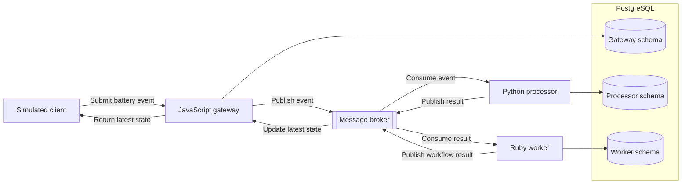

# TLCore System Overview

**Status:** Planned Phase 1 architecture

TLCore will begin as a small event-driven system that processes simulated device battery-status events. The application is intentionally focused so the project can spend more time on deployment, automation, observability, reliability, security, and troubleshooting.

This page describes the planned direction. The system has not been implemented yet, and details may change as Phase 1 work provides better evidence.

## Planned architecture

## Component responsibilities

| Component | Planned responsibility |
| --- | --- |
| Simulated client | Submit demonstration battery events and request the latest processed state |
| JavaScript gateway | Provide the external API, validate requests, publish events, and return the latest state |
| Message broker | Carry events between independently running applications |
| Python processor | Validate and classify battery levels as `normal`, `low`, or `critical` |
| Ruby worker | Consume every classification, record a no-action result for `normal`, perform simulated follow-up for `low` and `critical`, and publish a workflow outcome |
| PostgreSQL | Store application-owned processing and workflow state |

Each application has one clear responsibility. The language boundaries are intentional because TLCore is also a place to practice operating and coordinating different application stacks.

## Planned event flow

1. The simulated client sends a battery-status event to the gateway.
2. The gateway validates the request and publishes an accepted event.
3. The processor consumes the event and classifies the battery level.
4. The processor stores its result and publishes a classification event.
5. The worker consumes every classification, records a no-action result for `normal`, and performs the matching simulated follow-up for `low` and `critical`.
6. The worker stores its result and publishes a workflow event.
7. The gateway consumes the result and updates its latest-state view.
8. The client requests and receives the latest processed state.

The canonical request and event behavior is defined in the
[Phase 1 service contracts](../contracts/README.md). The services that will
implement those contracts are not yet complete.

## Data ownership

The applications may initially share one local PostgreSQL server, but each application will own a separate schema or assigned set of tables.

Applications will:

- Manage their own data and migrations.
- Avoid directly changing another application's data.
- Exchange cross-application information through events.

This keeps application responsibilities clear without requiring multiple database servers before the project needs them.

## Phase 1 boundaries

During Phase 1, the applications, message broker, and PostgreSQL will run directly on a local development machine.

Phase 1 will use:

- Simulated battery data.
- One event type.
- No user accounts.
- No real devices.
- No cloud deployment.
- No external notifications.
- No required paid services.

Containers, Kubernetes, cloud infrastructure, and real-device integrations belong to later phases.

## Open decisions

Phase 1 work will decide:

- Application frameworks and runtime versions.
- The message-broker product.
- Database libraries and migration tools.
- Local startup and testing commands.

These choices will be made when their requirements are clear. Important decisions that would be difficult to reverse will be recorded in an Architecture Decision Record.
